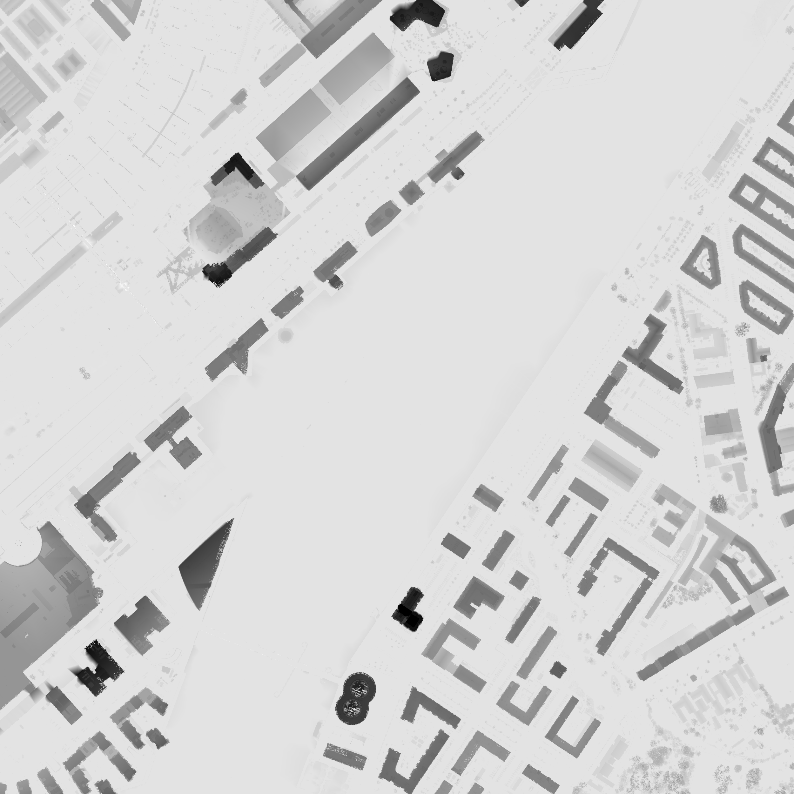
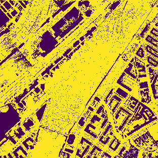

  <a href="./">
    <picture>
      <source height="125" media="(prefers-color-scheme: dark)" srcset="">
      
    </picture>
  </a>
   

  <em><b>Plads-i-solen</b> er en app du kan bruge til når du gerne vil finde den perfekte plads på en solskinsdag</em>

### BTW: App'en er under udvikling! 🥳 🚀

 

# 🧐 Projektbeskrivelse
Er det muligt at udpege områder med høj solintensitet. Ikke for at finde placeringer til solceller men for at finde steder man kan nyde solens stråler - særligt vigtigt i vores ellers mørke og regnfyldte land :)

Kort sagt bruger vi en normaliseret højdemodel til at beregne skygger ud fra lokale højder. Dette gør vi med et regelmæssigt tidsrum (hver time), hvilket vi samler til  en tidsserie som det kan ses her nedenfor:

**Read more about the Well app on [the project homepage](https://projects.colegaw.in/well-app?utm_source=GitHub&utm_medium=readme&utm_campaign=well_app_readme).**

# 👨‍💻 Tech stack

Hvilke teknologier bruger jeg til at lave det? Kort fortalt:

- GRASS GIS 
- Python
- DigitalOcean

Med lidt flere ord:

GRASS GIS er et stykke Open Source GIS Software der indeholder en lang række veludviklede algoritmer - herunder en avanceret skyggeberegner. 

Disse processer kobles sammen ved hjælp af Python. Det er ikke _helt_ plug&play at anvende Python sammen med GRASS men det kunne håndteres.

DigitalOcean bruges som platform til at køre det hele fra. En Ubuntu maskine trækker læsset.

# ✍️ To do
* Byg front-end til data udstilling
* Find en ordentlig clustering algoritme til tidsserier

# 💛
Lavet med kærlighed